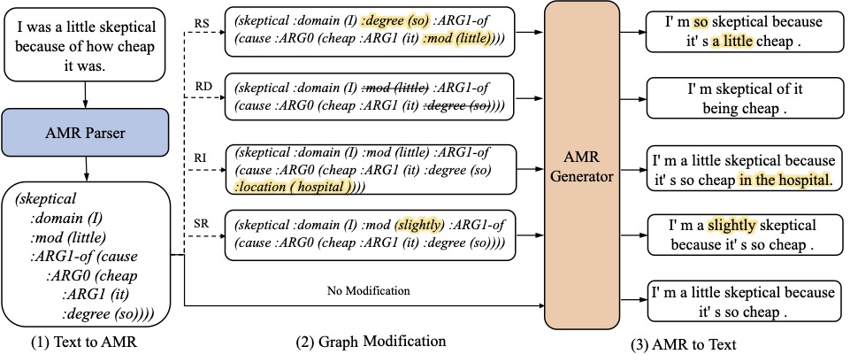

# AMR-DA: Data Augmentation By Abstract Meaning Representation

This repository contains the code for our ACL-2022 paper: AMR-DA: Data Augmentation By Abstract Meaning Representation.

This figure shows an overview of AMR-DA: AMR parser first transduces the sentence into an AMR graph, followed by an AMR graph extender to diversify graphs with different augmentation strategies; finally, the AMR generator synthesizes augmentations from AMR graphs.



The work adopts [SPRING](https://github.com/SapienzaNLP/spring) as AMR parser and [plms-graph2text](https://github.com/UKPLab/plms-graph2text) as AMR generator.

## Generated Data Examples
Augmentations examples for wiki:
[original data](https://drive.google.com/file/d/1SA8MsJvyDPdsQwZ0-QJ1jZ6P39Kp98WN/view?usp=sharing) and [generated augmentations](https://drive.google.com/file/d/1kXKeMwBqz0Bf0pyX_D4zFXCmZts8Iyg8/view?usp=sharing).

## Requirements 
```
pip install -r requirements.txt
```

## Text to AMR
Parse the plain text to amr graph
```
cd amr-parser-spring
bash predict_amr.sh <plain_text_file_path>(../data/wiki_data/wiki.txt)
```
Preprocess amr graph, convert to source and target string
```
cd data-utils/preprocess
bash prepare_data.sh <amr_file_path>(../../data/wiki_data/wiki.amr)
```

## Graph Modification
```
cd data_utils
python augment.py (modify parameters according to specific requirements)
```

## AMR to Text
Generate text from amr graph
```
cd plms-graph2text
bash decode_AMR.sh <model-path> <checkpoint> <gpu_id> <source file> <output-name>
(bash decode_AMR.sh /path/to/t5-base amr-t5-base.ckpt 0 ../data/wiki-data/wiki.source wiki-perd-t5-base.txt)
```

## Experiments in this paper
For STS tasks, we directly used the code from [SimCSE](https://github.com/princeton-nlp/SimCSE). For text classification tasks, please refer the code of [EDA](https://github.com/jasonwei20/eda_nlp).

## Citation
Please cite this repository using the following reference:
```

```

